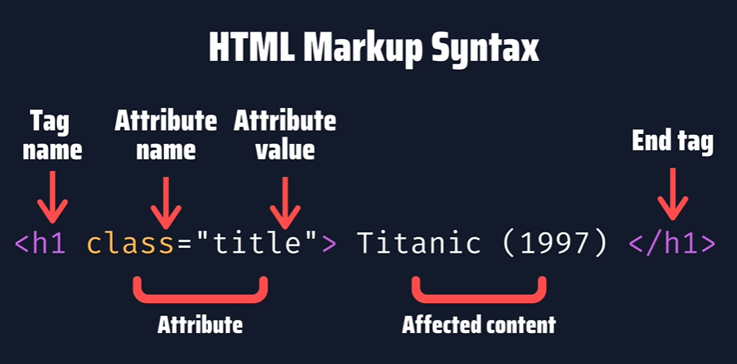

# HTML

## Tags
- \<head> 
- \<body>
- \<header>
- \<article>
- \
: paragraph
- \<h1>, \<h2>, \<h3>: heading 
- \
: divider - A kind of generic container
- \<nav>: navigational - Specifying a navigational region within a document like Pagination Bar
- \<li>: list item
- \<ul>: unordered list
- \<a>: anchor - Contains link
- \<buttion>
- \<table>
- \<td>: table data
- \<tr>: table row element
- \<iframe> - This makes it possible to embed another page within a page in HTML5, this is known as nested browsing.

# Find Elements
It's recommended to find elements in this order.
1. ID - First, we're going to look for the ID because they are unique, which means that we will always find an element by the ID.
2. Class name
3. Tag name, CSS Selector
4. Xpath - doesn't work on beautifulsoup